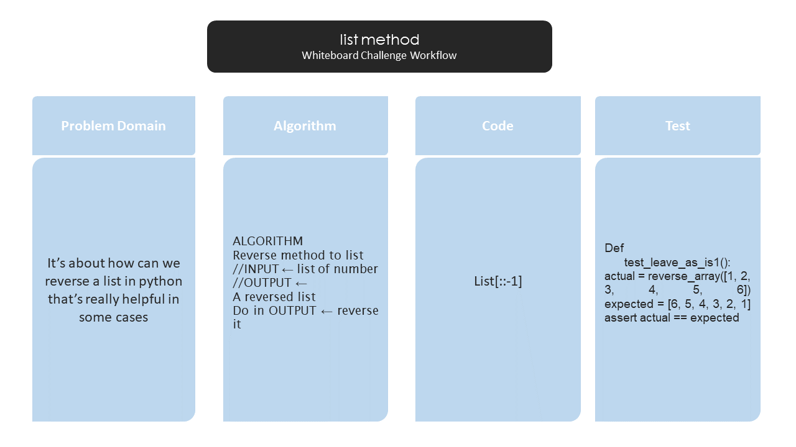

# Reverse an Array
The reverse() method reverses the elements of the list.
## Challenge
this challenge is how to reverse the list to whatever it was inside it

## Approach & Efficiency
1. try to understand the list method and play with it
2. try it on my code
3. dubug the problem I faced
4. solve it 

## Solution
<!-- Embedded whiteboard image -->

