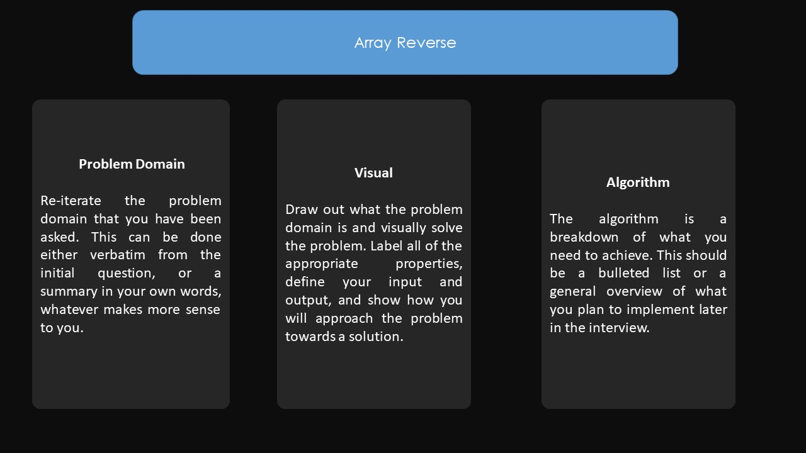

# Reverse an Array
it's about the array method and how to mainpluate it and play around it in python
## Challenge
this challenge is how to reverse an array to whatever it was inside it  

## Approach & Efficiency
1. try to understand the array method and play with it
2. try it on my code
3. dubug the problem I faced 
4. solve it 

## Solution
<!-- Embedded whiteboard image -->

