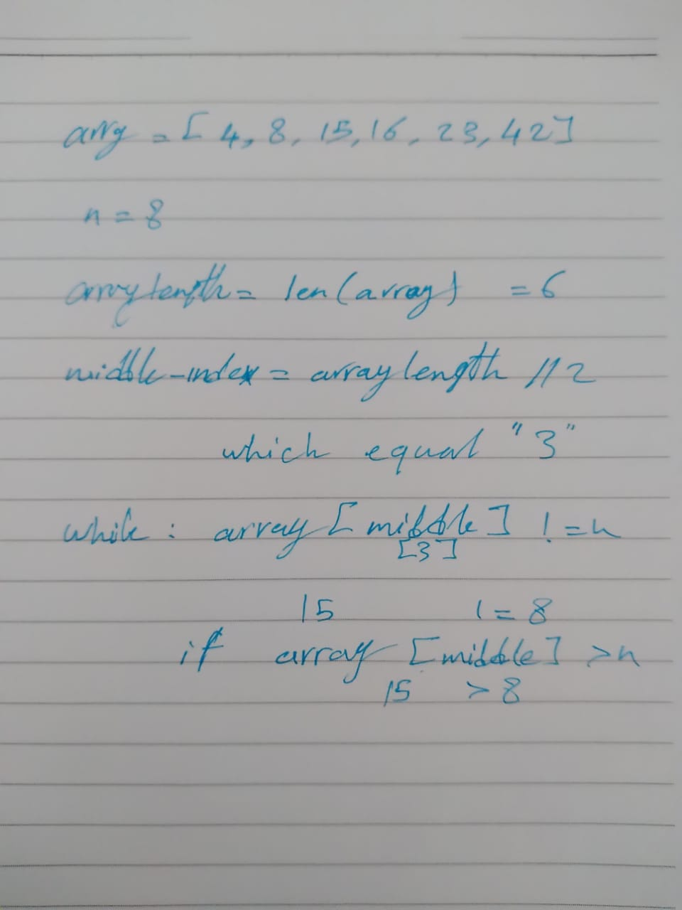

# Binary Search
funtion BinarySearch takes 2 parameters
1. sorted array 
2. number to find the index of
it's a way how to find a specific number in a list and fine the index of that number in Binary search method
## Challenge
it's all about how to find the number in the list in a smart way 

## Approach & Efficiency
1. think of a solution
2. try it on my code
3. dubug the code
4. solve it

## Solution

