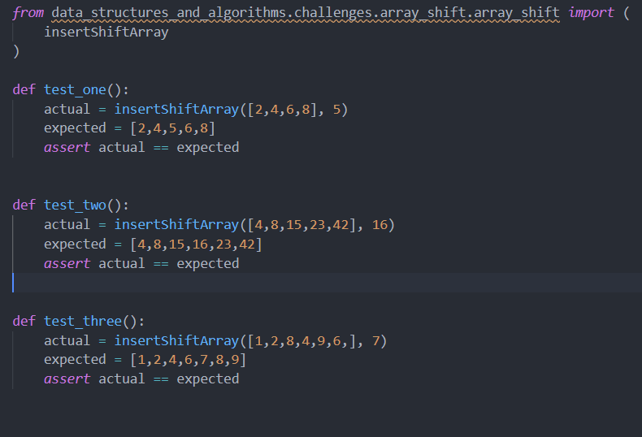

# shift in List
Shifting a list rotates its elements. Elements moved off the end are rotated to the beginning. For example, shifting [1, 2, 3, 4 ,5] twice to the right results in [4, 5, 1, 2, 3] and shifting twice to the left results in [3, 4, 5, 1, 2].
## Challenge
this challenge is how to shift a number to a list to the middle of the list

## Approach & Efficiency
1. try to understand the list method shift and play around it
2. try it on my code
3. dubug the problem I faced
4. solve it 

## Solution
<!-- Embedded whiteboard image -->

